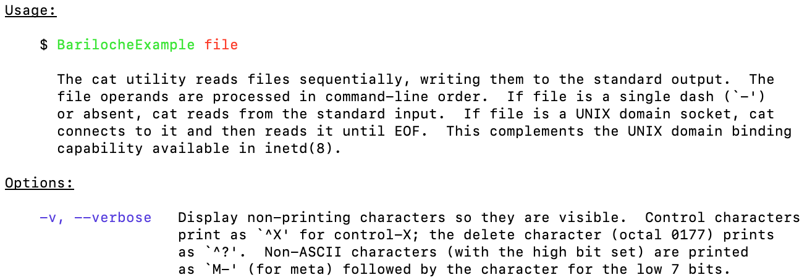
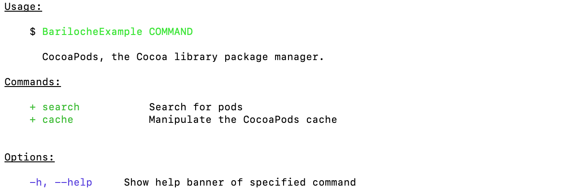
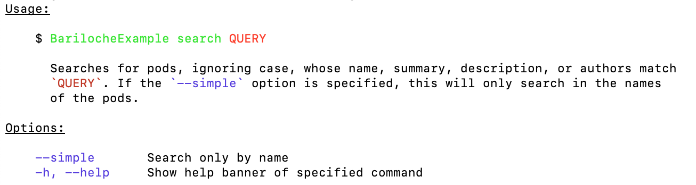

# ⛷ Bariloche 

Bariloche is an argument-parsing library designed to build declarative, colorful and type-safe commandline interfaces in Swift. With support for advanced zsh autocompletion.


# Installation


## Swift Package Manager

Add Bariloche as a dependency to your project:

```swift
dependencies: [
    .package(url: "https://github.com/Subito-it/Bariloche", from: "1.0.0")
]
```


## Run sample code

To run Bariloche demo in Xcode:

```bash
  git clone https://github.com/Subito-it/Bariloche; 
  cd Bariloche
  swift package update; swift package generate-xcodeproj
  xed .
```

select _BarilocheExample_ scheme and run it.


# Usage

Bariloche allows to declare interfaces both for flat (like `ls`, `cp`, `cat`) and nested (like `pod`, `docker`) command line tools.

Usage is as simple as defining a class that adopts the `Command` protocol, add `Argument` and `Flag` properties to your customly defined command. Through introspection Bariloche will determine how to parse command line arguments extracting the defined flags and arguments values.


## Parsing

Once you've defined your custom command/s you pass an instance of it to `Bariloche`'s initializer and call `parse()` to perform the command line parsing.

```
let parser = Bariloche(command: CatCommand())
let result = parser.parse()
```

The `parse()` returns a `[Command]` which contains all commands that were parsed successfully. For flat tools this array will always contain 1 item, for nested tools it may contain 1 or more items.


## Command protocol

The base component of the library is the `Command` protocol which defines the interface of a command.

```
protocol Command: AnyObject {
    var name: String? { get }
    var usage: String? { get }
    var help: String? { get }
    
    func shouldShowUsage() -> Bool
    func run() -> Bool
}
```

### Help banner data

- `name`: the name of a subcommand for nested command line interfaces shown in the help banner. For flat command line interfaces you can leverage the default implementation which returns `nil`
- `usage`: description of the command shown in the help banner. Note that argument and flags will be automatically highlighted if you refer to them with backticks
- `help`: for nested command line interfaces the help that is shown next to the help banner of the parent command

### Function callbacks

- `func shouldShowUsage() -> Bool` _(optional)_: this method will be invoked to determine if the help banner should be shown. Implementation is optional as you can rely on the default implementation which will present the help when appropriate
- `func run() -> Bool`: this method will be invoked when the command is successfully parsed. This should be the entry point for your business logic implementation. Returning false will stop further parsing. If no command return true help banner will be shown

## Argument

The `Argument` class allows you to add arguments (named, positional and variadic) to a command.

```
class Argument<Value> : Equatable, CustomStringConvertible {
    var value: Value?

    init(name: String, 
         kind: Kind, 
         optional: Bool, 
         help: String?, 
         autocomplete: Autocomplete)
}
```

### Help banner data

- `name`: the name of a the argument that will be shown in the help banner
- `optional`: a boolean to specify if the argument is optional
- `help` _(optional)_: the description of the argument that will be shown in the help banner

### Other

- `kind`: specify the type of argument, valid values are: `.positional`, `.named(let short: String, let long: String)` and `.variadic`
- `value`: the parsed argument value
- `autocomplete` _(otpional)_:` an enum that determines how argument will be autocompleted in shell, see [Autcompletion](#Autocompletion)

To initialize an instance you'll need to specify a generic type that will be used to determine the type of the value property. Currently supported type are: `Int`, `UInt`, `Float`, `TimeInterval`, `Bool`, `URL`. When specifying `URL` it will convert network and filesystem URLs automatically.

**Variadic arguments should specify an array of the aformentioned types** (e.g. `Argument<[Int]>()`).


When adding `Argument` properties your customly defined `Command` the order they're added will be reflected when parsing command line arguments. 

Take these 2 commands:

``` 
class MyCustomCommand1: Command {
    let arg1 = Argument<String>(name: "arg1", kind: .positional, optional: false)
    let arg2 = Argument<String>(name: "arg2", kind: .positional, optional: false)
}

class MyCustomCommand2: Command {
    let arg2 = Argument<String>(name: "arg2", kind: .positional, optional: false)
    let arg1 = Argument<String>(name: "arg1", kind: .positional, optional: false)
}
```


## Flag

The `Flag` class allows you to add flags to a command.

```
class Flag: Equatable, CustomStringConvertible {
    let short: String?
    let long: String?
    let help: String?
    var value: Bool = false
    
    init(short: String? = nil, long: String? = nil, help: String?)
}
```

### Help banner data

- `short`: the short version of the flag . Should not include dashes
- `long`: the long version of the flag . Should not include dashes
- `help`: the description of the argument that will be shown in the help banner

### Other

- `value`: a boolean that will be true when the flag was found among command line arguments


# Autocompletion

Bariloche supports zsh autocompletion out of the box. Everytime your execute your command the autocompletion file in your current user $fpath will be updated so it should just work after the first time you invoke your executable. If it still doesn't, you may need to close and reopen your terminal once.

The more `help` properties you fill (in `Flag`, `Argument` and `Autocomplete.Item`) the better the autocompletion result will be.


## Autocomplete

An enum that determines how arguments will be autocompleted in shell:

```
    enum Autocomplete {
        case none
        case items(_ items: [Item])
        case files(extension: String)
        case directories
        case paths(pattern: String?)
    }
```

- `none`: no further autocompletion will be performed
- `items`: use a set of customly defined `Autocomplete.Item`
- `files`: files matching a particular extension (e.g _json_). Passing nil will match all files but no directories
- `directories`: directories only
- `paths`: autocomplete with filesystem paths which can be further filtered out by specifying a matching pattern. For more information refer to the [zsh documentation](http://zsh.sourceforge.net/Doc/Release/Completion-System.html#Completion-System)


## Autocomplete.Item

A struct that models expected values when autocompleting arguments in shell

```
extension Autocomplete {
    struct Item {
        let value: String
        let help: String?
    }
}
```

- `value`: the expected value
- `help` _(optional)_: description to the expected value

An example Argument using expected values:

``` 
class MyCustomCommand: Command {
    let arg = Argument<String>(
        name: "arg",
        kind: .named(short: "t", long: "type"),
        optional: true,
        help: "Some help for the whole argument",
        autocomplete: .items([.init(value: "type1", help: "Type 1 help"),
                              .init(value: "type2", help: "Type 2 help")]))
}
```


# Examples

For the sake of example we recreate a partial implementation of the `cat` and cocoapods commands.


## Flat command

A flat command that takes a single string argument is shown below:

```
import Bariloche

class FlatCommand: Command {
    let usage: String? = "The cat utility reads files..."
    let verboseFlag = Flag(short: "v", long: "verbose", help: "Display non-printing characters...")
    let fileArgument = Argument<String>(name: "file", kind: .positional, optional: false, help: nil)
        
    func run() -> Bool {
        guard let value = fileArgument.value else {
            return false
        }
        
        print("Running with argument \(value)")
        return true
    }
}

let parser = Bariloche(command: CatCommand())
let result = parser.parse()
```

The help banner output will look like:

<p align="center"></p>


## Nested command

A nested command that takes a single string argument is shown below:

```
class CocoaPodsCommand: Command {
    let usage: String? = "CocoaPods, the Cocoa library package manager."
    let subcommands: [Command] = [SearchCommand(), CacheCommand()]
    
    func run() -> Bool {
        return true
    }
}

class SearchCommand: Command {
    let name: String? = "search"
    let usage: String? = "Searches for pods, ignoring case, whose..."
    let help: String? = "Search for pods"
    let simple = Flag(short: nil, long: "simple", help: "Search only by name")
    let query = Argument<String>(name: "QUERY", kind: .positional, optional: false, help: nil)
    
    func run() -> Bool {
        guard let query = query.value else {
            return false
        }

        print("Running with query \(query)")
        return true
    }
}

class CacheCommand: Command {
    let name: String? = "cache"
    let usage: String? = "Manipulate the download cache for pods, like printing the cache content or cleaning the pods cache."
    let help: String? = "Manipulate the CocoaPods cache"    
            
    func run() -> Bool {
        print("Running cache")
        return true
    }        
}

let parser = Bariloche(command: CocoaPodsCommand())
let result = parser.parse()
```
 
The help banner output for the root command will look like:

<p align="center"></p>

while the `search` subcommand help will look like:

<p align="center"></p>

Note how `QUERY` and `--simple` were automatically colored in the usage description.


# User interaction (stdin)

## Getting user input

Bariloche allows to prompt input from stdin using the `static func ask<Value>(_ question: String, endOfMarker: String = "", validate: ((_ answer: Value) throws -> Value)? = nil) -> Value` method. 

Parameters:
- `question`: the string that will be printed to stdout
- `endOfMarker`: value specifies which marker will return from stdin, the default value returns on first end-of-line ("\n"). 
- `validate`: an optional validation block that allows to reject the provided answer prompting question again by throwning an expection or returning a modified value as the return value of the `ask()` method. If the validation block isn't provided the return value of the method() will be the converted value from stdin.

### Example

Suppose you want to request an input from the user that is an `Int` in the 1-5 range that is then converted to the 0-4 range.

```
let targetIndex: Int = Bariloche.ask("Select an index:") { answer in
    guard 1...5 ~= answer else { throw Error("Invalid index") }
    return answer - 1
}
```


# Contributions

Contributions are welcome! If you have a bug to report, feel free to help out by opening a new issue or sending a pull request.


## Authors

[Tomas Camin](https://github.com/tcamin) ([@tomascamin](https://twitter.com/tomascamin))


## License

Barloche is available under the Apache License, Version 2.0. See the LICENSE file for more info.
